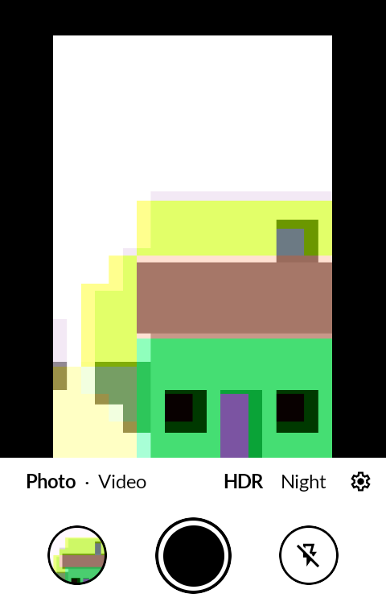
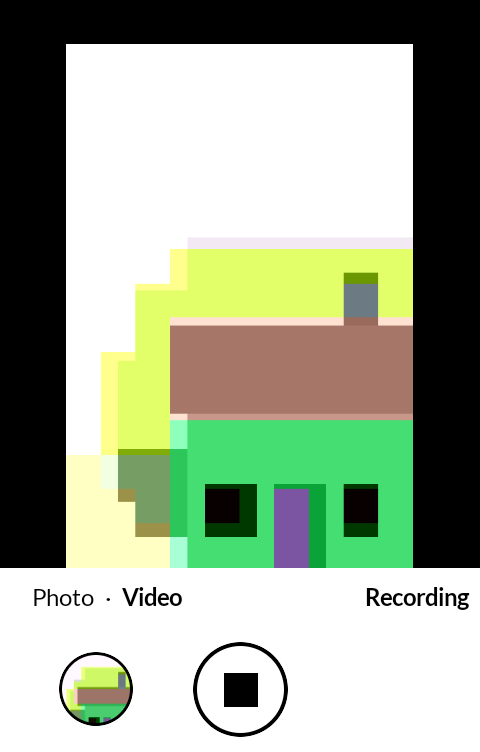
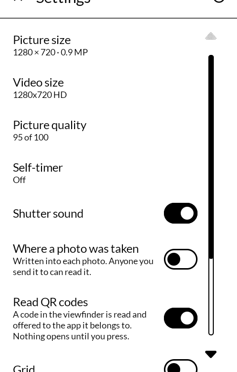
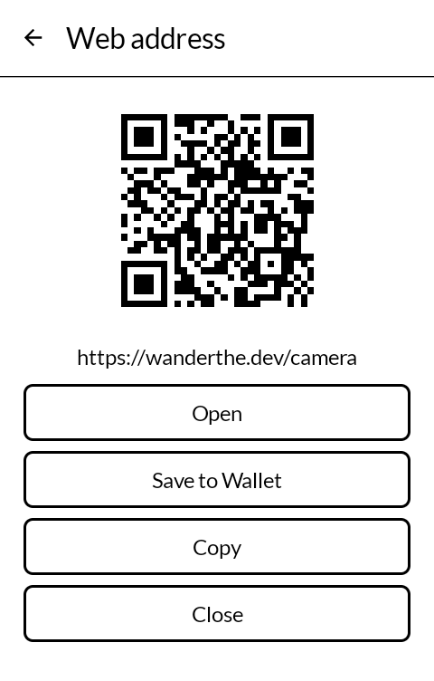

# Camera

写真機 *shashinki*

Photos and video on an E Ink phone, with the camera's own face kept out of the way: the
viewfinder, and below it the last picture, the shutter and the flash.

Built for the [Mudita Kompakt](https://mudita.com/products/kompakt/), whose 4.3" panel has
sixteen greys, a slow redraw, and is read outdoors as often as indoors. It is
[Open Camera](https://opencamera.org.uk) underneath.

## Screenshots

| | | | |
|---|---|---|---|
|  |  |  |  |

## What it does

- **Photos and video.** One line above the shutter switches between them. While recording,
  the shutter is a square and the line says so; there is no running clock.
- **The last picture** opens in Gallery (画廊 garō), inside its folder, whenever Gallery is
  installed, even if another gallery is the phone's default; otherwise in the phone's gallery.
- **HDR and Night**, on the same line, each on or off. HDR joins three exposures into one, so a
  bright sky keeps its detail; Night joins several quick frames, for less grain in the dark.
  Both are Open Camera's own, and take a few seconds to save — hold still until the gallery
  circle changes.
- **Flash** cycles through automatic, off and on in place, as Mudita's own camera does. On is
  a steady light, lit from the moment it is chosen, so the picture can be framed by it.
- **Tap the viewfinder** to focus there; pinch to zoom.
- **QR codes are read as you point at them.** The code comes up on a screen of its own, drawn
  clean, with what it is — a web address, a Wi-Fi network, a contact, an email, a phone number,
  a place, a sign-in code — and the one thing to do with it, handed to the app on the phone
  that does that: the browser, Android's own "save this network", Contacts, Email, Messaging,
  a map. **Save to Wallet** keeps the code as a card in Wallet (札入 satsuire), where it is on
  the phone, to show to a scanner or open again. Nothing opens until a button is pressed. Copy
  is always there. Reading can be turned off.
- **Nine settings**: reading QR codes, picture size, video size, picture quality, a self-timer, the shutter
  sound, writing where a photo was taken into it, a grid, and the folder under DCIM.

Photos and videos go to `DCIM/Camera`, where Android's own camera puts them, unless the folder
is changed, so they appear in Gallery. With Gallery's backup turned on, Camera tells Gallery the
moment it has saved a photo, and it goes up to Immich then.

When the camera cannot be opened — on a Kompakt, usually because the switch on the left side
has turned it off — the screen says so, and it says so too if the camera stops or a photo
fails.

It uses Android's Camera2 interface, which the Kompakt's camera supports in full. Open Camera
on its own starts the Kompakt on the older interface, where photos come out black.

## What it does not do

No front camera (the Kompakt has none), no RAW (its camera cannot), no panorama, HDR,
bracketing, or manual controls: Open Camera has all of them, and keeps them, but nothing here
reaches them. Nothing is drawn over the viewfinder — no clock, level or histogram — because
on this panel everything drawn there is redrawn with every frame.

## How it is made

Open Camera does everything a camera does: it opens the camera, focuses, takes the picture,
records, and saves. Its own activity still runs. Its buttons are still there, laid out but
never shown, and every press here calls the same method of Open Camera's that its own button
would have. What is new is a Jetpack Compose layer over the viewfinder, built with
[MMD](https://github.com/mudita/MMD), Mudita's E Ink component library.

The changes to Open Camera's own code are a dozen lines across five files, each marked
`shashinki`: the overlay draws nothing, its sixty-a-second redraw is off, and three hooks let
the new layer start and know when the camera's state changes. The first commit of this
repository is Open Camera exactly as upstream has it, so `git diff d084757` shows all of it.

## Building

```
./gradlew assembleRelease
```

A release is signed by a keystore in `signing/`, which is not in this repository. Without
it the release APK builds **unsigned** and will not install anywhere — there is no
fallback key by design.

## Credit

[Open Camera](https://opencamera.org.uk) by Mark Harman, GNU General Public License v3 or
later — the camera itself. Upstream: <https://sourceforge.net/p/opencamera/code/>.
Its third-party material is listed in its own credits: AndroidX (Apache 2.0), Google's
Material Design icons (Apache 2.0), and its sounds (CC0).

Icons in the new layer are [Material Symbols](https://fonts.google.com/icons), Apache
License 2.0. QR codes are read by [ZXing](https://github.com/zxing/zxing), Apache License 2.0.

## Licence

GNU General Public License v3 or later, as Open Camera is. See [LICENSE](LICENSE).

Open Camera is © 2013–2026 Mark Harman. The changes and the new interface are © wander wildwood.
